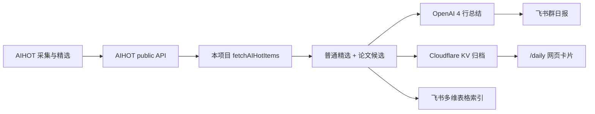

# AIHOT 日报接入决策说明

生成时间：2026-06-07  
分析对象：B 站视频《我做了个网站来缓解信息焦虑》、同题文字版、AIHOT 公开接口，以及本项目 `aihot-feishu-briefing`。

## 结论

本项目的日报不应该自己去抓 B 站视频、公众号文章，或者复刻 AIHOT 的 168 个上游信源。

更合理的做法是：把 AIHOT 当成上游信息处理系统，直接消费它已经开放的精选 API。AIHOT 负责全网采集、筛选、评分、摘要、分类和聚类；本项目负责把这些已经处理好的结果变成飞书日报、飞书多维表格索引和 `/daily` 网页归档。

这次分析后，项目层面的变化是：

- 新增并重写了这份说明文档：`AIHOT_抓取机制分析.md`。
- 没有改生产代码。
- 明确了当前日报的数据来源不是视频或公众号，而是 AIHOT public API。
- 明确了下一步优化方向：减少重复加工、补 API 健康检查、评估分页和分数字段展示。
- 额外安装了两个本地 Codex skills：`aihot`（AIHOT 资讯查询）和 `khazix-writer`（数字生命卡兹克公众号长文写作/润色风格）。

## 为什么要这么做

AI 资讯的问题不是信息不够，而是信息太多、太杂、太重复。

如果我们自己从头做抓取，会立刻遇到几个问题：

1. 信源维护成本高。AIHOT 作者自己也提到，信源是一个个挑出来的，当前持续监控 168 个源，还按权威程度分级。
2. 抓取方式不统一。有 RSS、HTML、公开 API、付费三方接口，不是写一个通用爬虫就能解决。
3. 噪声很大。很多官方站点并不只发 AI 内容，例如 Apple Newsroom 这类源会混进大量非 AI 信息。
4. 同一事件会重复出现。官网、官方 X、媒体、KOL 可能同时报道同一件事，直接抓会导致日报刷屏。
5. 让模型直接决定最终结果不可控。作者早期试过让模型直接判断重要性和是否精选，结果出现过分数漂移、重复入选、鸡汤转发高分等问题。

所以 AIHOT 的价值不只是“抓到了新闻”，而是它已经把最难维护的前置判断做掉了：信源筛选、噪声过滤、摘要翻译、质量评分、事件聚类和精选阈值。

对我们来说，直接复用 AIHOT 的结构化结果，收益明显大于重新造一套采集系统。

## AIHOT 解决了什么问题

AIHOT 的核心思路可以概括为一句话：

先管住信源，再让模型做有限判断，最后用代码做可控决策。

它不是把所有判断都交给大模型，而是做了分层：

- 信源层：人工挑选高质量来源，并区分官方博客、官方社交账号、KOL、媒体等权重。
- 采集层：按来源特性使用 RSS、HTML、公开 API 或三方数据接口。
- 预筛层：用便宜模型先判断是否和 AI 相关，控制成本。
- 评分层：模型只打分项分，不直接决定最终分。
- 决策层：代码根据来源权重、类别、阈值等计算最终质量分。
- 聚类层：用 embedding 把同一事件合并，优先展示最权威来源。
- 日报层：按已处理好的分类和分数分桶排序。

这种设计的好处是：

- 成本可控：便宜模型先挡掉大量无关内容。
- 质量稳定：最终排序和精选不完全依赖模型临场发挥。
- 可调试：分数、权重、阈值都能回测和调整。
- 可读性好：同一事件不会在日报里重复出现七八次。
- 维护边界清楚：模型做语义判断，代码做规则决策。

## 本项目为什么只接 AIHOT API

本项目当前定位是“AIHOT 飞书日报与归档层”，不是“AI 资讯采集平台”。

所以本项目只需要做好三件事：

1. 从 AIHOT 公开接口拉取精选条目。
2. 生成适合飞书阅读的简洁日报。
3. 把完整内容归档到 KV 和网页，方便回看。

对应代码入口是 `src/aihot.js`：

```js
const AIHOT_API = "https://aihot.virxact.com/api/public/items";
```

当前请求重点参数：

- `mode=selected`：只拉 AIHOT 已精选内容。
- `since`：控制时间窗口。
- `take`：控制条数。
- `category=paper`：论文候选单独拉取。

实测接口返回的核心字段包括：

```json
{
  "id": "...",
  "title": "...",
  "url": "...",
  "source": "...",
  "publishedAt": "...",
  "summary": "...",
  "category": "ai-products",
  "score": 80,
  "selected": true
}
```

也就是说，本项目拿到的不是原始网页，也不是公众号文案，而是 AIHOT 已经处理过的结构化精选结果。

## 当前项目流程

当前日报链路是：



这里有一个重要差异：

AIHOT 原站日报按作者解释，不需要再用大模型生成，因为入库阶段已经完成精选、分类、翻译和摘要。本项目目前额外调用 OpenAI 生成 4 行“今日总结”，这是我们自己的二次加工，而不是 AIHOT 原站日报的必要步骤。

## 当前存在的问题

### 1. 容易误解数据来源

最初容易把 B 站视频、公众号文案和 AIHOT 日报数据源混在一起。

现在需要明确：

- 视频和公众号文章只是解释 AIHOT 的设计。
- AIHOT 网站才是上游信息处理系统。
- 本项目消费的是 AIHOT API。

### 2. 本项目仍有一些重复加工

AIHOT 已经做了摘要、分类、分数和精选，本项目又额外做 OpenAI 今日总结。这个总结可以保留，但要注意边界：只能做朴素归纳，不能重新发明判断。

### 3. `score` 字段没有被充分使用

AIHOT API 返回了 `score`，但本项目当前日报展示主要用标题、来源、摘要、分类，没有突出分数。

如果想更贴近 AIHOT 原站，应考虑在日报或网页卡片里展示质量分，或者至少在排序/筛选时尊重上游分数。

### 4. API 分页还没有处理

接口返回 `hasNext` 和 `nextCursor`，说明存在分页能力。但本项目当前只请求一页。

普通日报可能够用；如果后续做周报、月报、专题回顾，就需要补分页能力。

### 5. 缺少 API schema 健康检查

本项目依赖外部公开接口，一旦字段名或返回结构变化，日报可能静默变差。

应该定期校验这些字段是否存在：

`id/title/url/source/publishedAt/summary/category/score/selected`

## 这么做的好处

继续接 AIHOT API，而不是自己爬全网，主要有四个好处：

1. 低维护成本：不用维护 168 个信源的抓取适配器。
2. 高信噪比：直接拿精选结果，绕过大量非 AI 内容和重复报道。
3. 快速落地：本项目只聚焦推送、归档、展示，不被上游采集拖慢。
4. 边界清晰：AIHOT 做信息处理，本项目做分发和知识库沉淀。

这正好符合当前项目的轻量化定位：不用本机常驻，不自建复杂爬虫，每天稳定生成可读、可回看的 AI 日报。

## 后续建议

优先级从高到低：

1. 在文档和 README 里统一表述：本项目消费 AIHOT public API，不直接抓全网。
2. 增加 API schema 检查，避免上游字段变化后无声失败。
3. 评估是否展示 `score`，让用户理解为什么某条被选中。
4. 研究 `nextCursor` 分页，先确认 API 参数，再决定是否实现。
5. 控制 OpenAI 总结的角色，只做归纳，不做二次评分或强推荐。
6. 如果未来要自建上游，再参考 AIHOT 的方法：白名单信源、源分级、便宜模型预筛、模型分项评分、代码算最终分、embedding 聚类。

## 资料来源

- 视频来源：[B 站 BV1fPLi6gErR](https://www.bilibili.com/video/BV1fPLi6gErR/)
- 同题文字版镜像：[新浪财经头条 - 这个封装了我3年自媒体经验的AI热点网站，今天向所有人免费开放。](https://finance.sina.com.cn/cj/2026-05-07/doc-inhwzrtr5282684.shtml)
- 后续接入说明：[装了这个AI热点Skill之后，你再也不需要自己去刷AI新闻了。](https://omnitools.ai/article/ai-skill-ai)
- AIHOT 官网：[https://aihot.virxact.com/](https://aihot.virxact.com/)
- 本项目相关代码：`src/aihot.js`、`src/index.js`、`src/config.js`、`src/openai.js`、`src/formatter.js`
